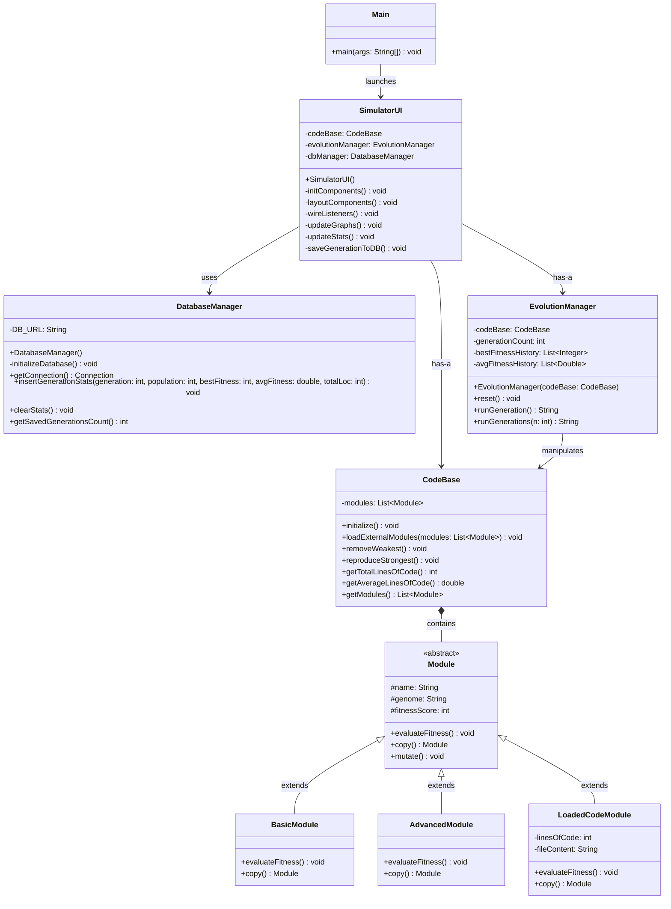
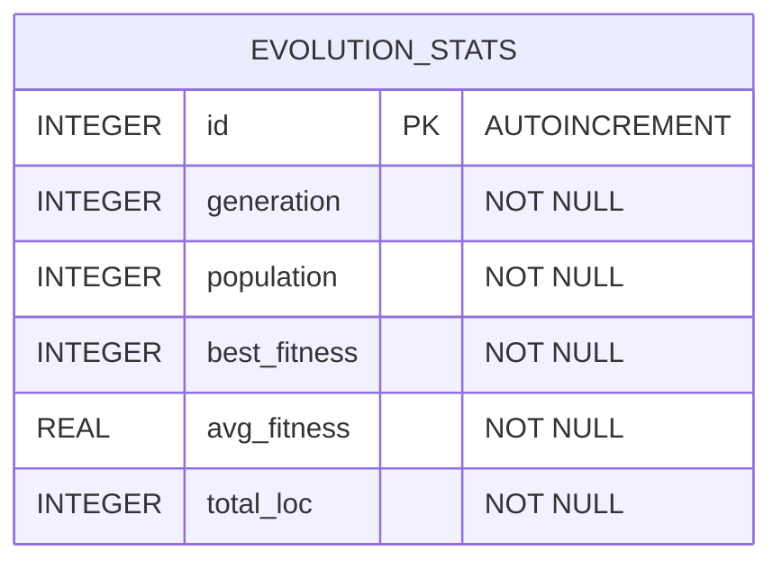

# Capstone Project Diagrams

This document contains the UML Class Diagram and Database Schema Diagram for the Evolution Simulator project.

## UML Class Diagram

This class diagram outlines the object-oriented structure of the simulation, showing how the GUI (`SimulatorUI`) manages the state (`EvolutionManager`, `CodeBase`) which in turn contains the individual organisms (`Module`).

## Database Schema Diagram

This diagram visualizes the SQLite database table used for persisting generation statistics.

